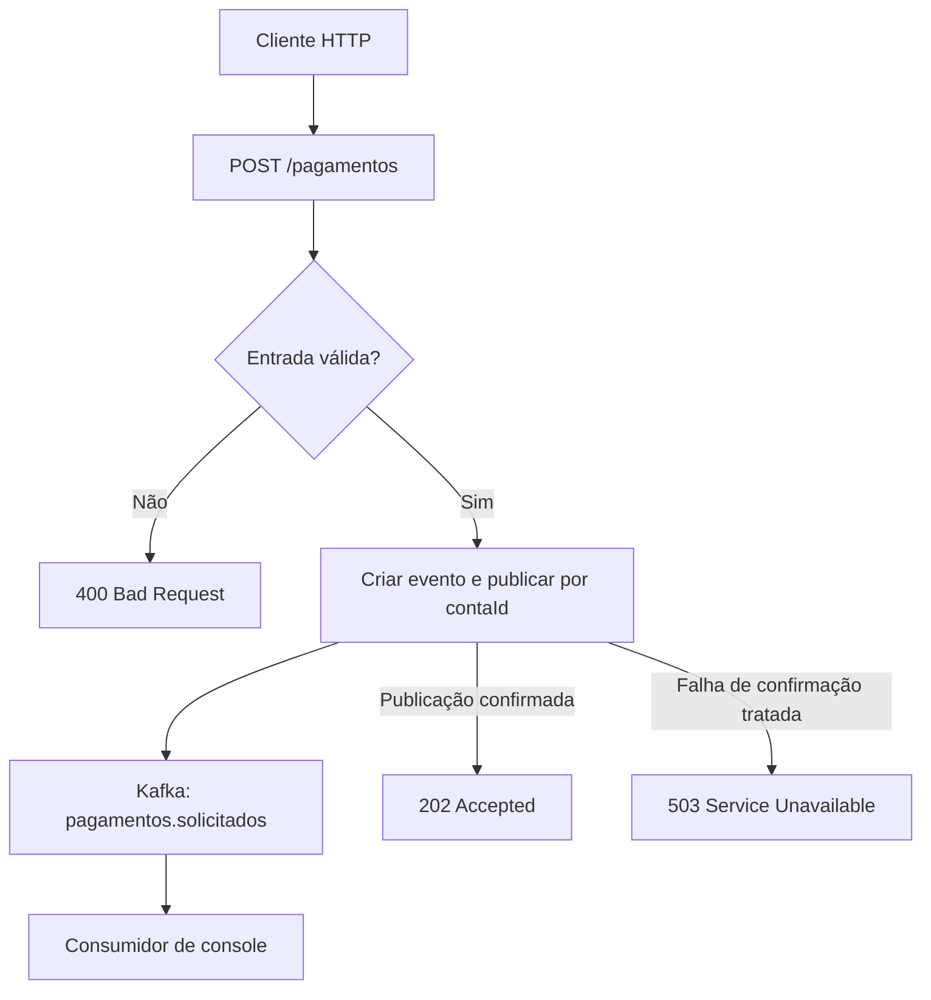

# Event-Driven Payments

Laboratório de pagamentos simulados orientados a eventos, desenvolvido para estudar comunicação assíncrona, consistência e recuperação de falhas com **Java, Spring Boot e Apache Kafka**. A evolução do projeto inclui uma interface Angular e execução em Kubernetes.

O objetivo é construir o fluxo por incrementos e demonstrar as decisões por trás de cada etapa: como publicar, como confirmar o recebimento, como distribuir eventos e como evitar efeitos duplicados quando surgirem falhas e reprocessamentos.

> **Status:** em desenvolvimento. Kafka local, produção/consumo pelo terminal e healthcheck da API foram validados. A implementação do endpoint de publicação foi preparada na etapa 2; sua validação integrada está pendente. Os comandos abaixo documentam essa etapa.

## Escopo atual

A API recebe uma solicitação de pagamento, valida os campos e publica um evento no tópico `pagamentos.solicitados`. Após a confirmação do Kafka, responde `202 Accepted` com os identificadores gerados e o status `SOLICITADO`.

A execução do pagamento simulado será responsabilidade de um consumidor Spring em uma próxima etapa. O projeto utiliza dados fictícios e não realiza transações financeiras reais.

| Capacidade | Situação |
| --- | --- |
| Kafka local com um broker e tópico com três partições | Validado no laboratório |
| Publicação e leitura pelo console do Kafka | Validado no laboratório |
| Spring Boot com Actuator e configuração YAML | Healthcheck validado |
| POST, validação, publicação com chave e tratamento de falhas | Código da etapa 2; teste integrado pendente |
| Consumidor Spring, persistência e idempotência de negócio | Planejado |
| Interface Angular, outbox, retry/DLT e Kubernetes | Planejado |

## Tecnologias

| Tecnologia | Uso nesta etapa |
| --- | --- |
| Java 21 | Linguagem e runtime do backend |
| Spring Boot 4.x / Spring MVC | API HTTP e configuração da aplicação |
| Spring for Apache Kafka 4.x | Publicação de eventos com `KafkaTemplate` |
| Jakarta Validation | Validação da entrada HTTP |
| Spring Boot Actuator | Healthcheck da aplicação |
| Apache Kafka 4.3.1 | Broker local na imagem `apache/kafka:4.3.1` |
| Docker Engine | Execução do Kafka |
| Maven Wrapper | Compilação e execução do backend |

O ambiente inicial do laboratório é Linux Mint 22.2, baseado em Ubuntu 24.04. As versões exatas das dependências Java devem ser consultadas no `pom.xml` do backend.

## Fluxo de publicação



A leitura do consumidor é independente da resposta HTTP. A confirmação de publicação permite responder `202`; a conclusão do pagamento será um resultado posterior do processamento de negócio.

## Organização do código

Esta documentação considera o backend em `backend/payments-api`, com o pacote raiz `br.com.denis.payments`.

| Caminho dentro de `backend/payments-api` | Responsabilidade |
| --- | --- |
| `src/main/java/br/com/denis/payments/api/` | Controller, contratos HTTP e tratamento de erros |
| `src/main/java/br/com/denis/payments/application/` | Serviço de solicitação e acompanhamento da publicação |
| `src/main/java/br/com/denis/payments/event/` | Contrato do evento `PagamentoSolicitado` |
| `src/main/resources/application.yaml` | Configuração do Spring, produtor Kafka e Actuator |
| `pom.xml` | Dependências e configuração do build |

O serviço de aplicação usa `KafkaTemplate` diretamente nesta etapa. A separação da publicação em uma porta e um adaptador pode ser avaliada quando surgirem necessidades concretas de evolução e testes.

## Executar localmente

Pré-requisitos: JDK 21 e Docker Engine funcionando. O projeto do backend deve conter o Maven Wrapper e as dependências Spring Web, Spring for Apache Kafka, Validation e Actuator.

### 1. Iniciar o Kafka

Na primeira execução, crie o container:

```bash
docker run -d \
  --name kafka-estudos \
  -p 127.0.0.1:9092:9092 \
  apache/kafka:4.3.1
```

Se o container já foi criado e está parado, reutilize-o:

```bash
docker start kafka-estudos
```

Acompanhe os logs:

```bash
docker logs -f kafka-estudos
```

Aguarde `Kafka Server started` e pressione `Ctrl + C` para encerrar apenas o acompanhamento dos logs.

### 2. Criar e conferir o tópico

```bash
docker exec kafka-estudos \
  /opt/kafka/bin/kafka-topics.sh \
  --bootstrap-server localhost:9092 \
  --create \
  --if-not-exists \
  --topic pagamentos.solicitados \
  --partitions 3 \
  --replication-factor 1
```

```bash
docker exec kafka-estudos \
  /opt/kafka/bin/kafka-topics.sh \
  --bootstrap-server localhost:9092 \
  --describe \
  --topic pagamentos.solicitados
```

O resultado esperado contém `PartitionCount: 3` e `ReplicationFactor: 1`. Se o tópico já existir, `--if-not-exists` não altera sua configuração; confira o resultado do `--describe`.

### 3. Configurar o backend

Em `backend/payments-api/src/main/resources/application.yaml`, integre esta configuração às demais propriedades da aplicação. Mantenha um único bloco `spring` no documento YAML. A extensão `.yml` também é aceita.

```yaml
spring:
  application:
    name: payments-api
  mvc:
    async:
      request-timeout: 30s
  kafka:
    bootstrap-servers: localhost:9092
    producer:
      acks: all
      key-serializer: org.apache.kafka.common.serialization.StringSerializer
      value-serializer: org.springframework.kafka.support.serializer.JacksonJsonSerializer
      properties:
        "[enable.idempotence]": true
        "[spring.json.add.type.headers]": false
        "[max.block.ms]": 5000
        "[request.timeout.ms]": 5000
        "[delivery.timeout.ms]": 15000

server:
  port: 8080

management:
  endpoints:
    web:
      exposure:
        include:
          - health
          - info

app:
  kafka:
    topics:
      pagamentos-solicitados: pagamentos.solicitados
```

Essa configuração usa o serializer do Spring Kafka 4.x. O endereço `localhost:9092` pressupõe que a API execute diretamente no Mint e que o Kafka esteja no container. Ao containerizar a API, será necessário configurar os endereços de acesso e os listeners anunciados pelo Kafka para essa rede.

### 4. Compilar e iniciar a API

A partir da raiz do repositório:

```bash
cd backend/payments-api
chmod +x mvnw
./mvnw clean verify
```

Após `BUILD SUCCESS`:

```bash
./mvnw spring-boot:run
```

Em outro terminal, consulte o healthcheck:

```bash
curl -i http://localhost:8080/actuator/health
```

Resposta esperada: HTTP `200` e `status` igual a `UP`. Os grupos `liveness` e `readiness` podem aparecer na resposta conforme a configuração.

O healthcheck reflete os indicadores configurados na aplicação. Para verificar a publicação no Kafka, execute o teste abaixo e correlacione os eventos pelos IDs.

### 5. Observar as mensagens

Mantenha este consumidor aberto em outro terminal:

```bash
docker exec -it kafka-estudos \
  /opt/kafka/bin/kafka-console-consumer.sh \
  --bootstrap-server localhost:9092 \
  --topic pagamentos.solicitados \
  --from-beginning \
  --property print.key=true \
  --property print.partition=true \
  --property print.offset=true
```

Esse comando cria um consumidor sem um grupo fixo informado e permite observar também os registros anteriores ainda retidos no tópico. Identifique a nova publicação pelo `eventId` retornado pela API. Eventos enviados nos exercícios iniciais sem chave podem aparecer com chave `null`.

### 6. Solicitar um pagamento

```bash
curl -i -X POST http://localhost:8080/pagamentos \
  -H 'Content-Type: application/json' \
  -d '{"contaId":"conta-001","valorCentavos":15000,"moeda":"BRL"}'
```

O mesmo método, URL e corpo JSON podem ser usados no Insomnia.

| Campo | Regra |
| --- | --- |
| `contaId` | Obrigatório, não vazio e com até 80 caracteres |
| `valorCentavos` | Obrigatório, representado por `Long`, maior que zero |
| `moeda` | Obrigatório e igual a `BRL` nesta etapa |

No contrato da API, `15000` representa R$ 150,00.

Resposta esperada: HTTP `202 Accepted`. Exemplo com identificadores ilustrativos:

```json
{
  "pagamentoId": "926886b2-aa72-436a-926f-1ecf1a9400cb",
  "eventId": "c717fb78-0240-4d5c-9d03-a78377426768",
  "status": "SOLICITADO"
}
```

Procure o mesmo `eventId` no terminal do consumidor. O backend também registra `eventId`, `pagamentoId`, tópico, partição e offset quando a publicação é confirmada.

## Contrato do evento

- **Tópico:** `pagamentos.solicitados`.
- **Chave Kafka:** `contaId`, enviada separadamente do valor da mensagem.
- **Valor:** JSON serializado a partir de `PagamentoSolicitado`.

Exemplo ilustrativo:

```json
{
  "eventId": "c717fb78-0240-4d5c-9d03-a78377426768",
  "pagamentoId": "926886b2-aa72-436a-926f-1ecf1a9400cb",
  "contaId": "conta-001",
  "valorCentavos": 15000,
  "moeda": "BRL",
  "ocorridoEm": "2026-10-06T21:00:00Z"
}
```

`eventId` identifica o evento; `pagamentoId` identifica a solicitação de pagamento. Ambos são UUIDs gerados pelo backend. `ocorridoEm` é registrado como `Instant`; a representação JSON do instante depende da configuração do serializer, e o exemplo usa ISO-8601.

## Decisões e limites

| Decisão | Motivo e limite |
| --- | --- |
| Valor em centavos | O contrato representa valores monetários com um número inteiro. A moeda aceita nesta etapa é BRL. |
| Chave por `contaId` | Com o particionador padrão e número de partições constante, a mesma chave é direcionada à mesma partição. Contas distintas podem compartilhar uma partição. |
| Três partições | Prepara o laboratório para estudar paralelismo e grupos de consumidores. Não oferece ordenação global entre partições. |
| `acks=all` | Aguarda as réplicas em sincronia. Com fator de replicação 1, existe somente uma cópia do registro no cluster. |
| Resposta após o envio confirmado | O `CompletableFuture` de `KafkaTemplate.send()` é encadeado até o controller. A construção da resposta 202 depende do sucesso da publicação. |
| API assíncrona | O Spring MVC acompanha o future. A chamada inicial a `send()` ainda pode esperar por metadados ou buffer até `max.block.ms`. |
| Idempotência do produtor | Protege contra duplicação causada por retries do próprio produtor. Repetir um POST ainda gera novos IDs e outro evento. |
| Tipo Java fora dos cabeçalhos | `spring.json.add.type.headers=false` evita vincular o contrato ao nome completo da classe Java. O consumidor tipado terá de conhecer o contrato por configuração. |
| Um broker local | Mantém o primeiro laboratório simples. Replicação, falhas de broker e alta disponibilidade exigirão uma etapa com mais brokers. |

A confirmação do Kafka não equivale a uma garantia de execução única de efeitos em banco ou serviços externos. Persistência, idempotência de negócio e consistência com o banco fazem parte das próximas etapas.

## Verificação manual

Os cenários abaixo descrevem resultados esperados da etapa 2. A validação integrada do endpoint ainda precisa ser registrada.

| Cenário | Como verificar | Resultado esperado |
| --- | --- | --- |
| Solicitação válida | Enviar o POST do exemplo | HTTP 202 e evento no tópico com o mesmo `eventId` da resposta |
| Valor inválido | Enviar `valorCentavos: 0` ou negativo | HTTP 400, indicação do campo inválido e nenhuma publicação causada por essa requisição |
| Conta ou moeda inválida | Usar conta vazia ou moeda diferente de BRL | HTTP 400 |
| Chave consistente | Publicar duas solicitações para `conta-001` | Mesma partição, mantendo a configuração do tópico e do particionador |
| Repetição de POST | Enviar duas vezes o mesmo corpo válido | Dois eventos com IDs distintos; evidencia a idempotência de negócio ainda pendente |
| Falha de publicação | Parar o broker local e tentar um POST | Falha tratada como HTTP 503, com IDs para correlação |

Para o último cenário, pare somente o container do laboratório:

```bash
docker stop kafka-estudos
```

Após observar a falha, inicie-o novamente:

```bash
docker start kafka-estudos
```

Uma falha de confirmação, como timeout, pode deixar o resultado da publicação indeterminado. O erro não prova que o registro deixou de ser armazenado; retries do POST precisarão de uma estratégia de idempotência.

`./mvnw clean verify` executa o ciclo de verificação Maven e os testes existentes no projeto. A suíte específica de integração, com cenários de falha e duplicidade, está no roadmap. Ainda não há métricas de cobertura ou desempenho registradas para esta etapa.

## Próximas etapas

- [ ] Validar o POST e registrar evidências da correlação entre resposta HTTP, logs e evento.
- [ ] Versionar a infraestrutura local com Docker Compose.
- [ ] Implementar o consumidor Spring e o processamento de pagamentos simulados.
- [ ] Estudar consumer groups, offsets, rebalances e paralelismo nas três partições.
- [ ] Persistir o estado dos pagamentos em PostgreSQL.
- [ ] Implementar idempotência HTTP e de consumo, incluindo concorrência e reentrega.
- [ ] Adicionar Transactional Outbox para conectar alterações no banco à publicação de eventos.
- [ ] Definir retry, backoff, DLT e reprocessamento, avaliando o impacto na ordenação.
- [ ] Criar testes de integração com Kafka e PostgreSQL via Testcontainers.
- [ ] Construir a interface Angular para solicitar pagamentos e acompanhar seus estados.
- [ ] Adicionar métricas, rastreamento e alertas para falhas, latência e consumer lag.
- [ ] Experimentar replicação, desligamento controlado e execução em Kubernetes.
- [ ] Documentar evolução dos contratos e decisões de arquitetura.

## Referências

- [Apache Kafka — Quickstart](https://kafka.apache.org/quickstart/)
- [Apache Kafka — configurações do produtor](https://kafka.apache.org/43/configuration/producer-configs/)
- [Spring Boot — suporte ao Kafka](https://docs.spring.io/spring-boot/reference/messaging/kafka.html)
- [Spring Kafka — envio de mensagens](https://docs.spring.io/spring-kafka/reference/kafka/sending-messages.html)
- [Spring Kafka — serialização e desserialização](https://docs.spring.io/spring-kafka/reference/kafka/serdes.html)
- [Spring MVC — tipos de retorno](https://docs.spring.io/spring-framework/reference/web/webmvc/mvc-controller/ann-methods/return-types.html)
- [Docker Engine — instalação na base Ubuntu](https://docs.docker.com/engine/install/ubuntu/)
